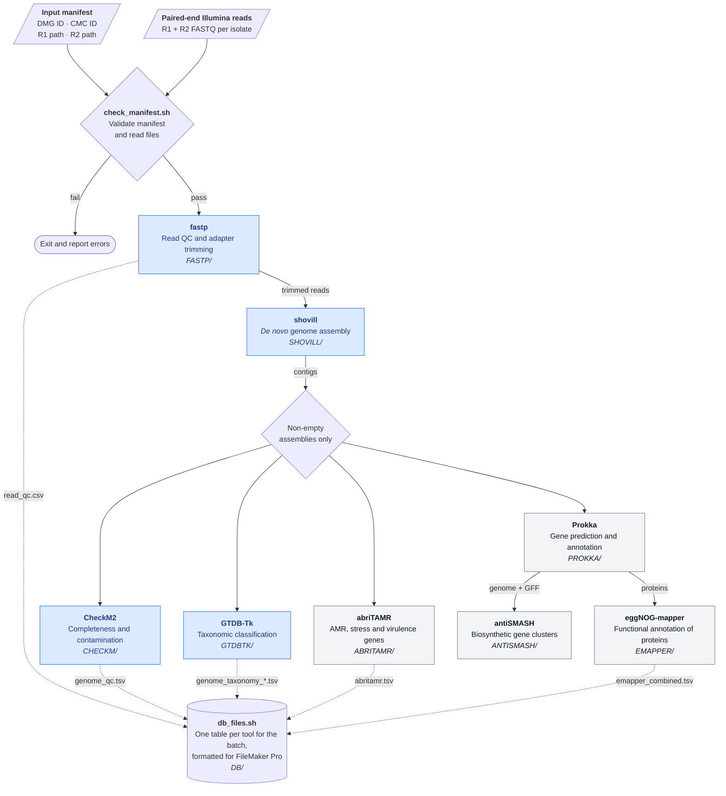

# microbiome-collection

**Pipeline for processing genomic data from the Centre for Pathogen Genomics Microbiome Collection (CMC)** — a biobank of genome-sequenced human gut microbiome isolates.  

This repository contains scripts for quality control, assembly, annotation, and taxonomic classification of isolate genomes. The workflow is designed for high-throughput processing of samples from a single sequencing batch (e.g. isolates sequenced periodically as part of an ongoing project), but it can be applied to any collection of bacterial isolates.

## Quick Start
The pipeline requires two positional arguments
- path to the input manifest (see _Input Manifest Format_ below)
- output directory

For example, run from the root of this repository:
```bash
./cmc.sh manifest_Run1.tsv Output_Run1/
```

To get a quick look at a batch (read QC, assembly, CheckM2 and GTDB-Tk only, without annotation), run:
```bash
SCRIPTS/cmc_prelim.sh manifest_Run1.tsv Output_Run1/
```

Each processing step is implemented as an individual script in the SCRIPTS/ directory, which can be either run separately or as part of the full pipeline.  
When running the full pipeline, each step will only run if the relevant output directory does not exist. 

If you want to only run the Prokka annotation step, you can do either of the following:  

Run the relevant script specifying the output directory (each step will identify its own input files based on outputs generated by previous steps)
```bash
SCRIPTS/prokka.sh Output_Run1/
```

Or delete the current output directory and run the full pipeline
```bash
rm -rf Output_Run1/PROKKA
./cmc.sh manifest_Run1.tsv Output_Run1/
```

## Requirements
Each step activates its own conda environment. Paths to conda, the environments and the reference databases are currently hardcoded in each script, so update these if running on a different system:

|Environment|Used by|
|---|---|
|fastp|fastp.sh, db_files.sh (also needs `jq` and `csvtk`)|
|shovill|shovill.sh|
|checkm2|checkm.sh|
|gtdbtk|gtdbtk_classify.sh, denovotree.sh|
|abritamr|abritamr.sh|
|prokka|prokka.sh|
|eggnog-mapper|emapper.sh|
|antismash|antismash.sh|
|drep|drep.sh|

Every step uses 24 threads by default. To change this, set `THREADS` when launching, e.g. `THREADS=48 ./cmc.sh manifest_Run1.tsv Output_Run1/`.

## Input Manifest Format
The input manifest is a headerless TSV file with four columns, one row per isolate:
|Column|Description|
|---|---|
|1|Sample basename (e.g. sequencing ID or barcode, e.g. DMG2306286)|
|2|CMC isolate ID (used to rename outputs)|
|3|Absolute path to R1 FASTQ|
|4|Absolute path to R2 FASTQ|

Example:
```
DMG2306286    CMC00001    /home/data/DMG2306286_S249_R1_001.fastq.gz    /home/data/DMG2306286_S249_R2_001.fastq.gz
DMG2306287    CMC00002    /home/data/DMG2306287_S250_R1_001.fastq.gz    /home/data/DMG2306287_S250_R2_001.fastq.gz
DMG2306288    CMC00003    /home/data/DMG2306288_S251_R1_001.fastq.gz    /home/data/DMG2306288_S251_R2_001.fastq.gz
```

Before anything runs, the manifest is checked by `SCRIPTS/check_manifest.sh` (which can also be run on its own). The pipeline will exit if the manifest:
- has Windows (CRLF) line endings or no trailing newline
- has any row without exactly four tab-separated, non-empty columns
- contains spaces in any column
- contains duplicate sample basenames, CMC IDs or read files, or uses the same file for R1 and R2
- points to read files that are missing or empty

## Manifest Generation Utility
A helper script is provided to automatically generate the manifest.
If you have a two-column file (called _names_ in the example below) containing sample basenames and CMC IDs, and a directory with the FASTQs, you can run:
```bash
SCRIPTS/makeinputmanifest.sh names /path/to/data/directory/
```
This simple script loops over each entry in names, lists the corresponding R1 and R2 FASTQs in the specified directory, and creates a complete four-column manifest.
(Note: this script is not smart — it assumes consistent file naming and structure.)

## Pipeline Overview


Steps shaded blue are also run by `cmc_prelim.sh`, which writes its tables to `DB_PRELIM/` instead of `DB/`. Dotted arrows show which outputs are combined into the database tables (see _Database Files_ below).

## Current Pipeline Steps
|Step|Tool|Purpose|Output directory|
|---|---|---|---|
|1|[fastp](https://github.com/OpenGene/fastp)|Quality control and adapter trimming|FASTP/|
|2|[shovill](https://github.com/tseemann/shovill)|_De novo_ genome assembly|SHOVILL/|
|3|[CheckM2](https://github.com/chklovski/CheckM2)|Assembly quality assessment|CHECKM/|
|4|[GTDB-Tk](https://github.com/Ecogenomics/GTDBTk)|Taxonomic classification|GTDBTK/|
|5|[abriTAMR](https://github.com/MDU-PHL/abritamr)|AMR profiling|ABRITAMR/|
|6|[Prokka](https://github.com/tseemann/prokka)|Genome annotation|PROKKA/|
|7|[eggNOG-mapper](https://github.com/eggnogdb/eggnog-mapper)|Functional annotation of Prokka-predicted proteins|EMAPPER/|
|8|[antiSMASH](https://github.com/antismash/antismash)|Identify secondary metabolite biosynthetic gene clusters|ANTISMASH/|
|9|`db_files.sh`|Combine per-isolate outputs into database tables|DB/|

Steps 3 onwards only run on isolates with a non-empty assembly. Software versions for each step are written to VERSIONS/.

## Database Files
The final step (`SCRIPTS/db_files.sh`) combines the per-isolate outputs into one table per tool for the whole batch, formatted for import into FileMaker Pro. Each table has one row per isolate (or per hit) and a sample ID column identifying the CMC isolate. Tables are written to `DB/` in the output directory:

|File|Source|Contents|
|---|---|---|
|read_qc.csv|fastp JSON reports|Post-filtering read and base counts, Q20/Q30 rates, mean read lengths, GC content and counts of reads removed by each filter|
|genome_qc.tsv|CheckM2 quality_report.tsv|CheckM2 completeness, contamination and assembly statistics, plus a `QC_Notes` column: `pass`, or `low completeness` (<90%) and/or `high contamination` (>5%)|
|genome_taxonomy_bac.tsv|GTDB-Tk bac120 summary|GTDB taxonomic classification of bacterial genomes (without the long `other_related_references` column)|
|genome_taxonomy_ar.tsv|GTDB-Tk ar53 summary|As above for archaeal genomes (only created if any were found)|
|abritamr.tsv|AMRFinderPlus output from abriTAMR|All AMR, stress and virulence gene hits|
|emapper_combined.tsv|eggNOG-mapper annotations|All eggNOG-mapper annotations, one row per protein|

`cmc_prelim.sh` runs `SCRIPTS/db_files_prelim.sh` instead, which only produces read_qc.csv, genome_qc.tsv and the taxonomy tables, and writes them to `DB_PRELIM/` so they are kept separate from the full pipeline outputs in `DB/`.

## Next steps
Major
- rewrite in Nextflow  

Minor
- Add support for ONT and hybrid assemblies
- Alternative taxonomic classification: [Barbet](https://github.com/houndry/barbet)
- Alternative annotation: [Bakta](https://github.com/oschwengers/bakta)
- Functional profiling: [gutSMASH](https://github.com/victoriapascal/gutsmash)
- Bacteriocin detection: [BAGEL](https://github.com/annejong/BAGEL4)
- CAZyme detection: [dbCAN3](https://bcb.unl.edu/dbCAN3/)
- Phenotypic trait prediction: [Traitar](https://github.com/hzi-bifo/traitar)
